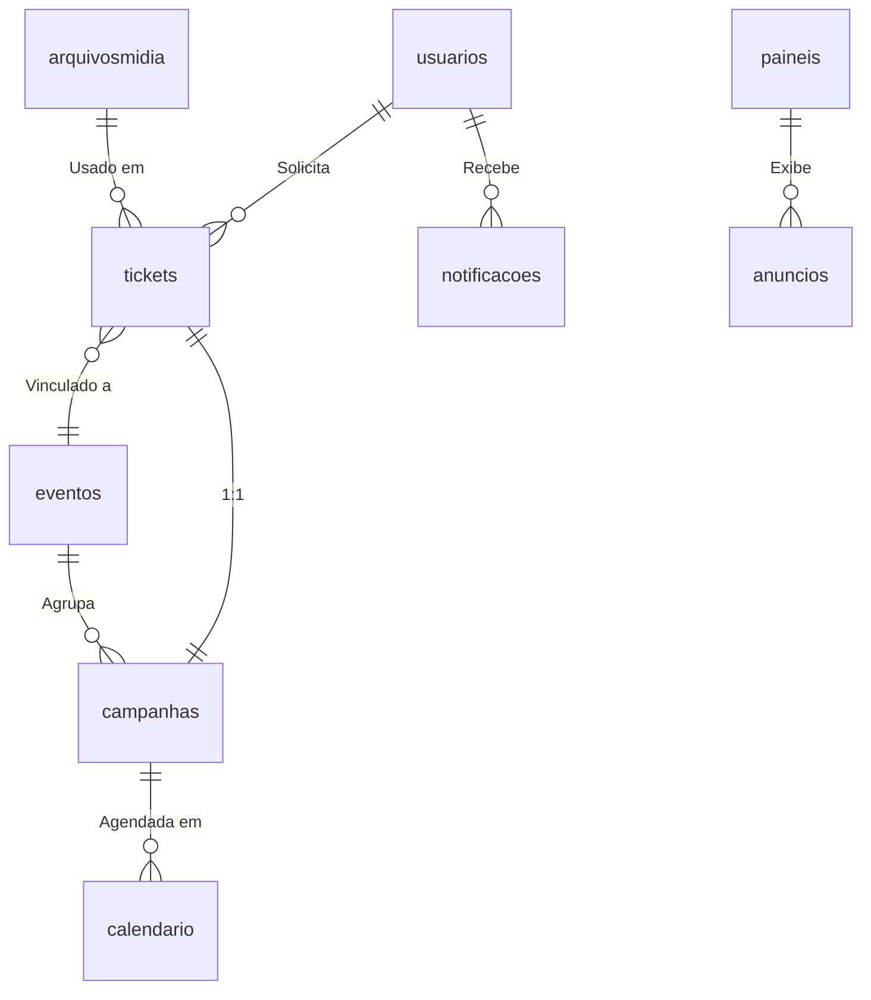

# 🎲 Documentação do Banco de Dados

**Última atualização:** 16/05/2025  

## 📊 Visão Geral

O banco de dados gerencia:

- 🎫 **Tickets (Campanhas)**  
  Solicitações de exibição de anúncios que passam por um fluxo de aprovação estilo Kanban.

- 🖥️ **Painéis Digitais**  
  Controle técnico e gerenciamento dos dispositivos físicos que exibem os anúncios.

- 🎓 **Eventos Acadêmicos**  
  Eventos organizados pela instituição que podem estar vinculados a campanhas e painéis.

### ⚙️ Funcionalidades adicionais:

- ✅ **Fluxo Kanban** para aprovação dos anúncios.
- 🛠️ **Controle técnico** dos hardwares dos painéis digitais.
- 🔔 **Notificações** multifuncionais para manter os usuários informados.
- 📅 **Integração com o calendário acadêmico** para agendamento automático de campanhas e eventos.

---

## Coleções
| Coleção          | Descrição                                      | Chave de Relacionamento                     |
|------------------|-----------------------------------------------|---------------------------------------------|
| `usuarios`       | Perfis de acesso                              | `tickets.solicitanteId`, `eventos.responsavelId` |
| `tickets`        | Solicitações de campanhas                     | `campanhas.ticketId`, `eventos.tickets`     |
| `campanhas`      | Períodos de trabalho/exibição                 | `tickets._id`, `calendario.campanhaId`      |
| `paineis`        | Painéis físicos e configurações               | `anuncios.painelId`                         |
| `eventos`        | Eventos acadêmicos pré-definidos              | `campanhas.eventoId`                        |
| `notificacoes`   | Alertas personalizados                        | `usuarios._id`, `tickets._id`               |
| `arquivosmidia`  | Arquivos de mídia                             | `tickets.briefing`, `tickets.arquivosMidia` |
| `logs_acao`      | Auditoria de ações críticas                   | `usuarios._id`                              |
| `configuracoes`  | Configurações globais do sistema              | -                                           |
| `calendario`     | Agenda de exibição de campanhas               | `campanhas._id`, `paineis._id`              |
| `anuncios`       | Anúncios em exibição                          | `paineis.anunciosAtivos`                    |

---

## Detalhamento das Coleções

### 1. `usuarios`
```json
{
  "_id": "ObjectId('665f4d6e8c1d8b4a7e3f1a2b')",
  "nome": "Fulano Ciclano",
  "email": "fulano.ciclano@faculdade.edu",
  "perfil": {
    "type": "solicitante",
    "enum": ["solicitante", "designer", "suporte", "visualizacao"]
  },
  "departamento": {
    "type": "Coordenação",
    "enum": ["Atlética", "Coordenação", "Direção", "Administrativo", "Secretaria", "DTI"]
  },
  "criadoPor": "ObjectId('665f4d6e8c1d8b4a7e3f1a2c')",
  "dataCriacao": "ISODate('2025-05-01T10:00:00Z')",
  "ativo": true
}
```
### 2. `tickets`
```json
{
  "_id": "ObjectId('665f4d6e8c1d8b4a7e3f1a2d')",
  "solicitanteId": "ObjectId('665f4d6e8c1d8b4a7e3f1a2b')",
  "designerId": "ObjectId('665f4d6e8c1d8b4a7e3f1a2e')",
  "titulo": "SERJO",
  "status": {
    "type": "solicitado",
    "enum": ["solicitado", "em_desenvolvimento", "aguardando_aprovacao", "em_exibicao", "expirado"]
  },
  "descricao": "Design com as cores da faculdade promovendo os jogos",
  "briefing": ["ObjectId('665f4d6e8c1d8b4a7e3f1a30')"],
  "arquivosMidia": ["ObjectId('665f4d6e8c1d8b4a7e3f1a31')"],
  "tempo_exibicao": 7,
  "dataAbertura": "ISODate('2025-05-01T10:30:00Z')",
  "eventoId": "ObjectId('665f4d6e8c1d8b4a7e3f1a32')"
}
```

### 3. `campanhas`
```json
{
  "_id": "ObjectId('665f4d6e8c1d8b4a7e3f1a33')",
  "ticketId": "ObjectId('665f4d6e8c1d8b4a7e3f1a2d')",
  "periodo_trabalho": {
    "inicio": "ISODate('2025-05-01T00:00:00Z')",
    "fim": "ISODate('2025-05-05T23:59:59Z')"
  },
  "periodo_exibicao": {
    "inicio": "ISODate('2025-05-06T00:00:00Z')",
    "fim": "ISODate('2025-05-12T23:59:59Z')"
  }
}
```

### 4. `paineis`
```json
{
  "_id": "ObjectId('665f4d6e8c1d8b4a7e3f1a34')",
  "nome": "DSM-4",
  "localizacao": "Sala 03",
  "descricao": "TV principal da sala",
  "resolucao": "1920x1080",
  "ip_maquina": "192.168.1.50",
  "status": "ativo",
  "isSmartTV": true,
  "temCaboRede": true,
  "quantasEntradasHDMI": 3,
  "marcaTV": "LG",
  "anunciosAtivos": ["ObjectId('665f4d6e8c1d8b4a7e3f1a35')"]
}
```

### 5. `eventos`
```json
{
  "_id": "ObjectId('665f4d6e8c1d8b4a7e3f1a32')",
  "nome": "Semana Acadêmica 2025",
  "periodo": {
    "inicio": "ISODate('2025-05-06T00:00:00Z')",
    "fim": "ISODate('2025-05-12T23:59:59Z')"
  },
  "recorrente": true,
  "responsavelId": "ObjectId('665f4d6e8c1d8b4a7e3f1a2c')"
}
```

### 6. `notificacoes`
```json
{
  "_id": "ObjectId('665f4d6e8c1d8b4a7e3f1a36')",
  "usuarioId": "ObjectId('665f4d6e8c1d8b4a7e3f1a2e')",
  "tipo": "design",
  "mensagem": "Novo ticket atribuído: Semana Acadêmica 2025",
  "prioridade": "alta",
  "contexto": {
    "ticketId": "ObjectId('665f4d6e8c1d8b4a7e3f1a2d')"
  },
  "lida": false,
  "dataCriacao": "ISODate('2025-05-01T11:00:00Z')"
}
```

### 7. `arquivosmidia`
```json
{
  "_id": "ObjectId('665f4d6e8c1d8b4a7e3f1a30')",
  "nome": "briefing_semana_academica.pdf",
  "tipo": "pdf",
  "tamanho": 2048,
  "caminho": "/arquivos/2025/semana_academica.pdf",
  "uploadPor": "ObjectId('665f4d6e8c1d8b4a7e3f1a2b')",
  "dataUpload": "ISODate('2025-05-01T10:15:00Z')"
}
```

### 8. `logs_acao`
```json
{
  "_id": "ObjectId('665f4d6e8c1d8b4a7e3f1a37')",
  "acao": "atualizar_ticket",
  "usuarioId": "ObjectId('665f4d6e8c1d8b4a7e3f1a2e')",
  "entidade": "tickets",
  "entidadeId": "ObjectId('665f4d6e8c1d8b4a7e3f1a2d')",
  "dadosAntes": { "status": "solicitado" },
  "dadosDepois": { "status": "em_desenvolvimento" },
  "timestamp": "ISODate('2025-05-01T11:30:00Z')"
}
```

### 9. `configuracoes`
```json
{
  "_id": "ObjectId('665f4d6e8c1d8b4a7e3f1a38')",
  "maxTempoExibicao": 20,
  "notificacoesPadrao": {
    "design": { "prioridade": "alta" },
    "suporte": { "prioridade": "media" }
  },
  "atualizadoPor": "ObjectId('665f4d6e8c1d8b4a7e3f1a2c')",
  "dataAtualizacao": "ISODate('2025-05-01T09:00:00Z')"
}
```

### 10. `calendario`
```json
{
  "_id": "ObjectId('665f4d6e8c1d8b4a7e3f1a39')",
  "campanhaId": "ObjectId('665f4d6e8c1d8b4a7e3f1a33')",
  "painelId": "ObjectId('665f4d6e8c1d8b4a7e3f1a34')",
  "horarios": [
    { 
      "inicio": "08:00", 
      "fim": "20:00", 
      "dias": ["seg", "ter", "qua", "qui", "sex"] 
    }
  ]
}
```

### 11. `anuncios`
```json
{
  "_id": "ObjectId('665f4d6e8c1d8b4a7e3f1a35')",
  "nome": "Anúncio Semana Acadêmica",
  "arquivoId": "ObjectId('665f4d6e8c1d8b4a7e3f1a31')",
  "painelId": "ObjectId('665f4d6e8c1d8b4a7e3f1a34')",
  "dataInicio": "ISODate('2025-05-06T00:00:00Z')",
  "dataFim": "ISODate('2025-05-12T23:59:59Z')"
}
```
---
---


## 📌 **Regras de Negócio**

### 1️⃣ **Validação de Status de Tickets**

- ✅ Um ticket só pode mudar para `em_exibicao` se:
  - 🟢 O painel estiver com status **ativo**.
  - ⏰ O período de exibição da campanha estiver dentro da validade.

### 2️⃣ **Restrições de Mídia**

- 🚫 Painéis sem `temCaboRede: true` **não podem exibir vídeos**.
- 📄 Arquivos **PDF** só são permitidos no campo `briefing`.

### 3️⃣ **Notificações Automáticas**

- 📆 Eventos com `recorrente: true` geram notificações para o **Suporte** com **7 dias de antecedência**.
- 🎨 **Designers** recebem notificações de **alta prioridade** quando **novos tickets** são atribuídos.