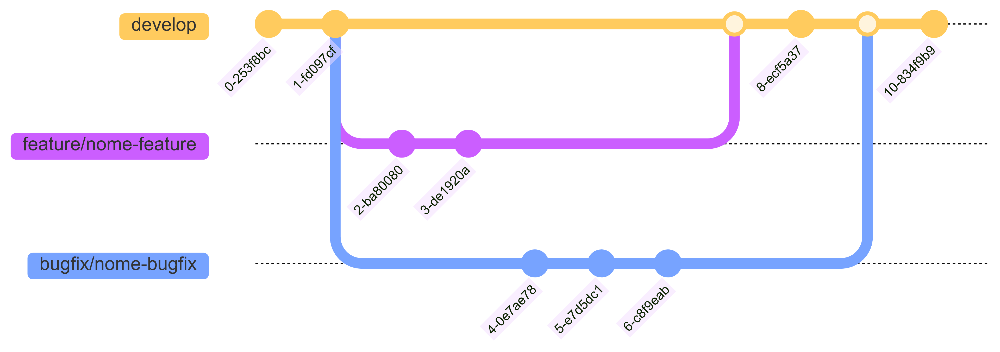
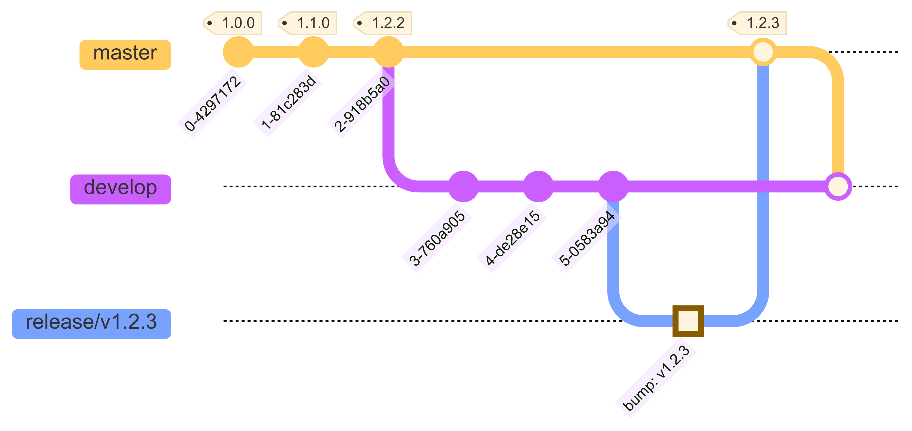
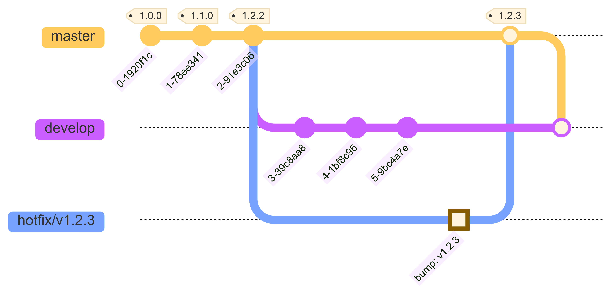

## ⚙️ Fluxo de desenvolvimento 

No projeto Intranet nós seguimos o padrão [GitFlow](https://www.atlassian.com/br/git/tutorials/comparing-workflows/gitflow-workflow) para tratar do versionamento Git, além de boas práticas para escrita de commits utilizando o [Conventional Commits](https://www.conventionalcommits.org/en/v1.0.0/) e versionamento semântico seguindo o [semver](https://semver.org/lang/pt-BR/).

### Fluxo de feature/bugfix

*Gráfico do fluxo de trabalho com git para merge de feature/bugfix*

### Fluxo de deploy (release/hotfix)

*Gráfico do fluxo de trabalho com git para merge de release*

*Gráfico do fluxo de trabalho com git para merge de hotfix*

## 💡 Boas práticas Git
Como boas práticas no versionamento de código usamos o [semver](https://semver.org/lang/pt-BR/)
### Criação de branchs
`[feature/nome-feature]` = Branch destinada à desenvolvimento de feature;

`[bugfix/descricao-curta-bug]` = Branch destinada à resolução de bug produtivo com criticidade baixa;

`[release/v0.0.0]` = Branch destinada à deploy para geração de release;

`[hotfix/v0.0.0]` = Branch destinada à deploy para resolução de bug produtivo de criticidade alta;

### Padrão de commits
Sempre que possível, utilizar prefixos que definam o contexto da alteração de forma clara e objetiva.

`<type>[optional scope]: <description>`

Referência: [Conventional Commits 1.0.0](https://www.conventionalcommits.org/en/v1.0.0/)
